# Agentic RAG Learning Project



This repository serves as a learning project exploring advanced **Retrieval-Augmented Generation (RAG)** patterns using **LangGraph**, **Gemini**, and **Qdrant**.

## Overview
The goal of this project is to progress from a simple baseline RAG implementation towards autonomous agentic patterns that self-correct and gracefully handle bad retrievals.

### Data Flow


### Implemented Patterns
1. **Naive RAG:**  
   The foundational baseline (`naive_rag.py`). Represents standard "embed query → retrieve top k → generate". Subject to classic RAG failure modes (hallucinations, multi-hop misses).
2. **Corrective RAG (CRAG):**  
   Uses `LangGraph` to grade retrieved chunks using an LLM evaluator (`crag_grader.py`). If chunks are deemed irrelevant, the graph falls back to a web search via **Tavily** (`web_search.py`) to gather facts from outside the vector database.
3. **Self-RAG:**  
   Introduces an active reflection loop within the graph (`self_rag.py`). Uses LLM reflection tokens (`IsRETRIEVE`, `IsREL`, `IsSUP`, `IsUSE`) to independently control generation routes. If the drafted answer hallucinates unsupported claims or fails to answer the question, the system loops back and regenerates using stricter prompts.
4. **RAG-Fusion:**  
   Addresses multi-hop and comparative queries (`rag_fusion.py`). Uses an LLM to decompose a complex query into multiple targeted variants (`rag_fusion_decomposer.py`), searches the vector database for all variants, and merges the result sets using Reciprocal Rank Fusion (`rag_fusion_rrf.py`) to synthesize a comprehensive answer.
5. **Adaptive RAG:**  
   Dynamically routes queries to the most appropriate retrieval strategy at runtime (`adaptive_rag.py`). Uses a routing LLM to classify questions and direct them to either semantic vector search (Qdrant), structured SQL search (SQLite), or a hybrid of both, before generating the final answer.

## Tech Stack
- **LLM:** Gemini 2.5 Flash & Gemini Embeddings (`google-generativeai`)
- **Orchestration:** LangGraph (StateGraphs and conditional routing)
- **Vector DB:** Qdrant Database (Local)
- **Web Fallback:** Tavily API

## Getting Started
Ensure you have the appropriate environment variables set in an `.env` file:
- `GEMINI_API_KEY`
- `TAVILY_API_KEY`

Run any of the pattern demos locally:
```bash
python .\crag.py
python .\self_rag.py
python .\rag_fusion.py
python .\adaptive_rag.py
```
